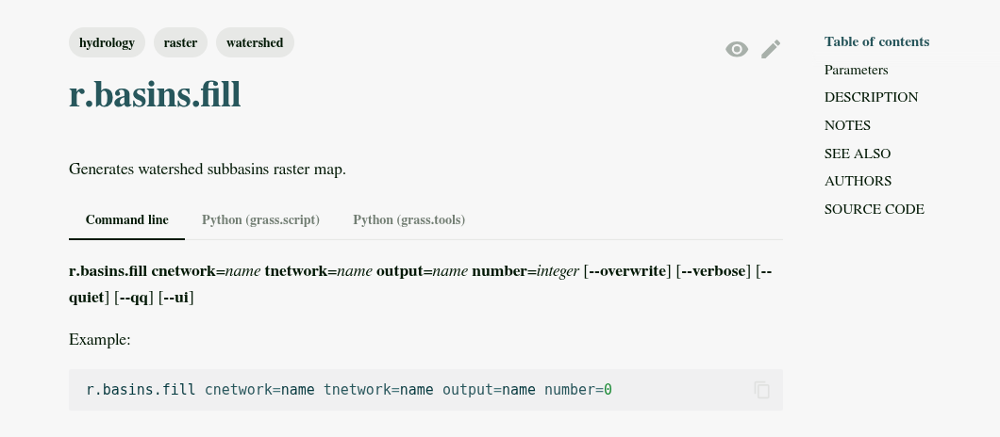

[grass-addons]: https://github.com/OSGeo/grass-addons
[gunittest_testing]: https://grass.osgeo.org/grass85/manuals/libpython/gunittest_testing.html#
[grass_parser]: https://grass.osgeo.org/grass85/manuals/parser_standard_options.html
[grass_style_guide]: https://grass.osgeo.org/grass85/manuals/style_guide.html
[grass_keywords]: https://grass.osgeo.org/grass-devel/manuals/keywords.html
[contributing]: https://github.com/OSGeo/grass-addons/blob/grass8/CONTRIBUTING.md
[cookiecutter]: https://cookiecutter.readthedocs.io/en/stable/
[cookiecutter_install]: https://cookiecutter.readthedocs.io/en/stable/installation.html#install-cookiecutter
[grass-addon-cookiecutter]: https://github.com/OSGeo/grass-addon-cookiecutter

# Part 2 - From GRASS scripts to GRASS addons

## Learning Objectives

By the end of this part, you will be able to:

1. Define what a GRASS addon is :green_heart: and when to create one :green_heart:
2. Describe the structure of a GRASS addon and community best practices for development
3. Develop command line and graphical user interfaces for GRASS addons
4. Be ready to contribute GRASS addons to the community repository :green_heart:

## Getting Started

### What is a GRASS addon?

A [GRASS addon][grass-addons] is a standalone module that extends the
functionality of GRASS software.

### When should you create an addon?

- [ ] You have a script that could be useful to others
- [ ] You want to share your code with the GRASS community
- [ ] You want to contribute to the GRASS ecosystem
- [ ] You want to maintain your code independently
from the core GRASS development cycle
- [ ] You want to publish your research methods as GRASS modules

## Addon Development Environment

### Setting up the development environment

- [grass-addons][grass-addons] repository
- [grass-addon-cookiecutter][grass-addon-cookiecutter]

### Addon structure

Example code structure for a generated addon:

```text
r.myaddon
├── Makefile
├── r.myaddon.html
├── r.myaddon.ipynb (optional)
├── r.myaddon.py
└── testsuite
    └── test_r_myaddon.py

```

#### Makefile

A Makefile is required to build and install the addon within the GRASS environment.
Here is a simple example of a Makefile for an addon named `r.myaddon`:

```makefile
MODULE_TOPDIR = ../..

PGM=r.myaddon

include $(MODULE_TOPDIR)/include/Make/Script.make

default: script
```

**MOULE_TOPDIR**
  points to the root directory of the GRASS source code, which is necessary for
  building the addon.

**PGM**
  specifies the name of the addon module.
  
**include**
  directive includes the standard Makefile rules for building GRASS scripts.

**default**
target specifies that the default action is to build the script.

#### r.myaddon.py

##### header template

A standard header template for a GRASS addon contains metadata about the module,
its authors, purpose, and licensing information.

```python
#!/usr/bin/env python

##############################################################################
# MODULE:    r.myaddon
#
# AUTHOR(S): Corey White <email or work affiliation>
#            Caitlin Haedrich <email or work affiliation>
#
# PURPOSE:   Demo how to create a GRASS addon at FOSS4GNA 2025
#
# COPYRIGHT: (C) 2025 by Corey White and the GRASS Development Team
#
#            This program is free software under the GNU General Public
#            License (>=v2). Read the file COPYING that comes with GRASS
#            for details.
##############################################################################
```

#### Standardized options and flags

After the header, we define the module's description, keywords, options and flags.
GRASS provides a standardized way to define these using the
[standard Parser Options][grass_parser] standard option structure.

##### description and keywords

We define the module's description and keywords using special comments that are
parsed by GRASS when the module is run. For example:

```python
# %module
# %description: This is a demo GRASS addon module.
# %keyword: demo
# %keyword: addon
# %end
```

> Note: The `%module` and `%end` tags are required to define the module
metadata.

**Keywords**
  help users find the module when searching in GRASS, and the
  description provides a brief overview of what the module does.

Look at existing Keywords in the
[keyword list documentation][grass_keywords]
when deciding on keywords for your addon.

##### options and flags

In python, we define options and flags using special comments that are parsed
by GRASS when the module is run. For example, to define an input raster option, we
can use the following syntax:

```python
# %option G_OPT_R_INPUT
# %end
```


[*The keywords are rendered as `tags` in the documentation.*](https://grass.osgeo.org/grass85/manuals/r.basins.fill.html)

The complete list of standard options and flags can be found in the
[GRASS Parser Options documentation][grass_parser].

### Community Best Practices

- [GRASS Programming Style Guide][grass_style_guide]

### Testing and debugging

[GRASS Testing Framework][gunittest_testing]
[GRASS Unit Testing with Python](https://github.com/OSGeo/grass-addons/blob/grass8/doc/development/submitting/UNIT_TESTS.md)

## Addon Development Steps

### 1. Fork GRASS addons

We can follow the contributing documentation from the [grass-addons][contributing]
GitHub repository.

### 2. Create a new addon using Cookiecutter

[Cookiecutter][cookiecutter] is set up to help generate the required boiler
plate structure of an addon.

> Cookiecutter is already install in this codespace, but you will need to
install it on your own machine using the following documentation for local
use ([cookiecutter install docs][cookiecutter_install]).

```bash
# Use for the current stable release
# cookiecutter gh:OSGeo/grass-addon-cookiecutter

cookiecutter https://github.com/cwhite911/grass-addon-cookiecutter --checkout grass-tools
```
